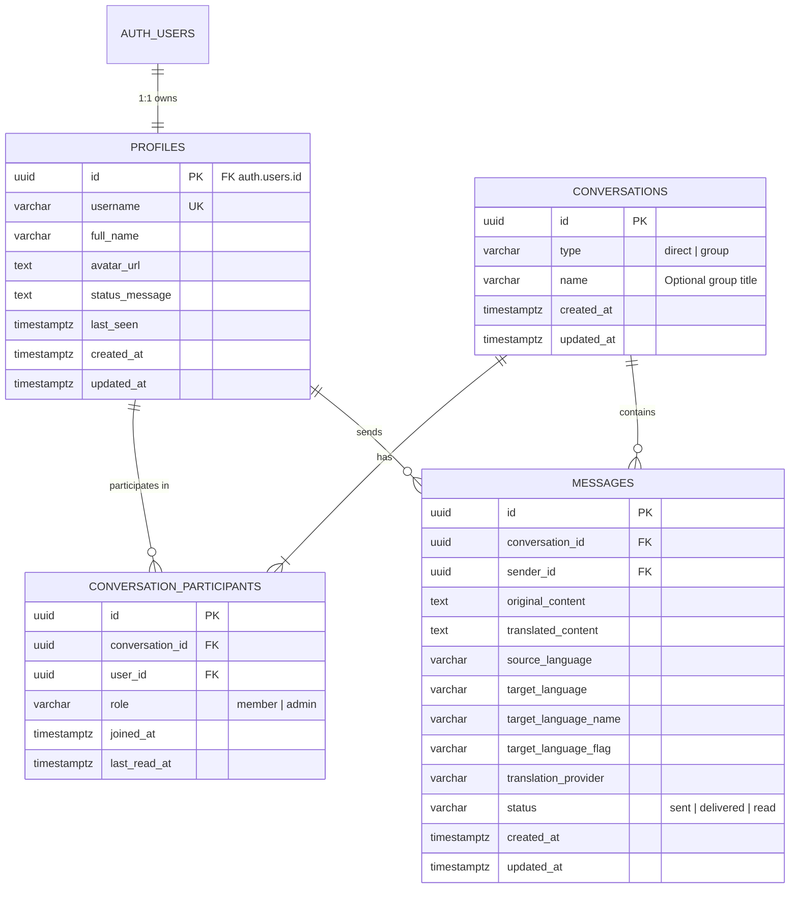

# 🗄️ WhatsApp 2 - Database Schema & Security Specification

> **Engine**: PostgreSQL 15+ (Supabase Native or Cloud Postgres)  
> **Security Model**: Row Level Security (RLS) enabled on all tables  
> **Primary Keys**: UUIDv4 (`gen_random_uuid()`)  
> **Timezone**: UTC (`TIMESTAMPTZ`)

---

## 1. Entity Relationship Diagram (ERD)



---

## 2. Complete SQL Migration Script (Supabase / Postgres DDL)

Eseguire questo script nel **SQL Editor di Supabase** o nel client PostgreSQL per inizializzare l'intero database.

```sql
-- 1. Enable UUID extension
CREATE EXTENSION IF NOT EXISTS "uuid-ossp";
CREATE EXTENSION IF NOT EXISTS "pgcrypto";

-- ==========================================
-- TABLE: PROFILES (Extends auth.users)
-- ==========================================
CREATE TABLE IF NOT EXISTS public.profiles (
    id UUID PRIMARY KEY REFERENCES auth.users(id) ON DELETE CASCADE,
    username VARCHAR(50) UNIQUE NOT NULL,
    full_name VARCHAR(100),
    avatar_url TEXT DEFAULT 'https://api.dicebear.com/7.x/bottts/svg?seed=default',
    status_message TEXT DEFAULT 'Disponibile su WhatsApp 2',
    last_seen TIMESTAMPTZ DEFAULT NOW(),
    created_at TIMESTAMPTZ DEFAULT NOW() NOT NULL,
    updated_at TIMESTAMPTZ DEFAULT NOW() NOT NULL
);

-- ==========================================
-- TABLE: CONVERSATIONS
-- ==========================================
CREATE TABLE IF NOT EXISTS public.conversations (
    id UUID PRIMARY KEY DEFAULT gen_random_uuid(),
    type VARCHAR(20) NOT NULL DEFAULT 'direct' CHECK (type IN ('direct', 'group')),
    name VARCHAR(100),
    created_at TIMESTAMPTZ DEFAULT NOW() NOT NULL,
    updated_at TIMESTAMPTZ DEFAULT NOW() NOT NULL
);

-- ==========================================
-- TABLE: CONVERSATION_PARTICIPANTS
-- ==========================================
CREATE TABLE IF NOT EXISTS public.conversation_participants (
    id UUID PRIMARY KEY DEFAULT gen_random_uuid(),
    conversation_id UUID NOT NULL REFERENCES public.conversations(id) ON DELETE CASCADE,
    user_id UUID NOT NULL REFERENCES public.profiles(id) ON DELETE CASCADE,
    role VARCHAR(20) NOT NULL DEFAULT 'member' CHECK (role IN ('member', 'admin')),
    joined_at TIMESTAMPTZ DEFAULT NOW() NOT NULL,
    last_read_at TIMESTAMPTZ DEFAULT NOW() NOT NULL,
    CONSTRAINT uq_conversation_user UNIQUE (conversation_id, user_id)
);

-- ==========================================
-- TABLE: MESSAGES (Dual text: Original + Babel Translation)
-- ==========================================
CREATE TABLE IF NOT EXISTS public.messages (
    id UUID PRIMARY KEY DEFAULT gen_random_uuid(),
    conversation_id UUID NOT NULL REFERENCES public.conversations(id) ON DELETE CASCADE,
    sender_id UUID NOT NULL REFERENCES public.profiles(id) ON DELETE CASCADE,
    original_content TEXT NOT NULL,
    translated_content TEXT NOT NULL,
    source_language VARCHAR(10) DEFAULT 'auto',
    target_language VARCHAR(20) NOT NULL,
    target_language_name VARCHAR(50) NOT NULL,
    target_language_flag VARCHAR(10) NOT NULL,
    translation_provider VARCHAR(50) DEFAULT 'primary',
    status VARCHAR(20) NOT NULL DEFAULT 'sent' CHECK (status IN ('sending', 'sent', 'delivered', 'read', 'failed')),
    created_at TIMESTAMPTZ DEFAULT NOW() NOT NULL,
    updated_at TIMESTAMPTZ DEFAULT NOW() NOT NULL
);

-- ==========================================
-- INDEXES FOR HIGH-PERFORMANCE CHAT QUERYING
-- ==========================================
CREATE INDEX IF NOT EXISTS idx_messages_conversation_created 
    ON public.messages (conversation_id, created_at DESC);

CREATE INDEX IF NOT EXISTS idx_participants_user_conv 
    ON public.conversation_participants (user_id, conversation_id);

CREATE INDEX IF NOT EXISTS idx_profiles_username 
    ON public.profiles (username);

CREATE INDEX IF NOT EXISTS idx_conversations_updated 
    ON public.conversations (updated_at DESC);

-- ==========================================
-- AUTOMATIC TIMESTAMP TRIGGERS
-- ==========================================
CREATE OR REPLACE FUNCTION update_timestamp_column()
RETURNS TRIGGER AS $$
BEGIN
    NEW.updated_at = NOW();
    RETURN NEW;
END;
$$ LANGUAGE plpgsql;

DROP TRIGGER IF EXISTS trg_profiles_updated_at ON public.profiles;
CREATE TRIGGER trg_profiles_updated_at
    BEFORE UPDATE ON public.profiles
    FOR EACH ROW EXECUTE FUNCTION update_timestamp_column();

DROP TRIGGER IF EXISTS trg_conversations_updated_at ON public.conversations;
CREATE TRIGGER trg_conversations_updated_at
    BEFORE UPDATE ON public.conversations
    FOR EACH ROW EXECUTE FUNCTION update_timestamp_column();

DROP TRIGGER IF EXISTS trg_messages_updated_at ON public.messages;
CREATE TRIGGER trg_messages_updated_at
    BEFORE UPDATE ON public.messages
    FOR EACH ROW EXECUTE FUNCTION update_timestamp_column();

-- ==========================================
-- AUTO-SYNC USER CREATION FROM AUTH.USERS
-- ==========================================
CREATE OR REPLACE FUNCTION public.handle_new_user()
RETURNS TRIGGER AS $$
BEGIN
    INSERT INTO public.profiles (id, username, full_name, avatar_url)
    VALUES (
        NEW.id,
        COALESCE(NEW.raw_user_meta_data->>'username', 'user_' || SUBSTRING(NEW.id::text, 1, 8)),
        COALESCE(NEW.raw_user_meta_data->>'full_name', 'WhatsApp 2 User'),
        COALESCE(NEW.raw_user_meta_data->>'avatar_url', 'https://api.dicebear.com/7.x/bottts/svg?seed=' || NEW.id::text)
    )
    ON CONFLICT (id) DO NOTHING;
    RETURN NEW;
END;
$$ LANGUAGE plpgsql SECURITY DEFINER;

DROP TRIGGER IF EXISTS on_auth_user_created ON auth.users;
CREATE TRIGGER on_auth_user_created
    AFTER INSERT ON auth.users
    FOR EACH ROW EXECUTE FUNCTION public.handle_new_user();
```

---

## 3. Supabase Row Level Security (RLS) Policies

Queste policy assicurano che solo i partecipanti a una conversazione possano visualizzare e inviare messaggi.

```sql
-- 1. Enable RLS on all public tables
ALTER TABLE public.profiles ENABLE ROW LEVEL SECURITY;
ALTER TABLE public.conversations ENABLE ROW LEVEL SECURITY;
ALTER TABLE public.conversation_participants ENABLE ROW LEVEL SECURITY;
ALTER TABLE public.messages ENABLE ROW LEVEL SECURITY;

-- 2. Profiles: Everyone authenticated can read profiles; Users can only edit their own
CREATE POLICY "Profiles are viewable by authenticated users"
    ON public.profiles FOR SELECT
    TO authenticated
    USING (true);

CREATE POLICY "Users can update their own profile"
    ON public.profiles FOR UPDATE
    TO authenticated
    USING (auth.uid() = id);

-- 3. Conversations: Users can see conversations they belong to
CREATE POLICY "Users can view conversations they participate in"
    ON public.conversations FOR SELECT
    TO authenticated
    USING (
        EXISTS (
            SELECT 1 FROM public.conversation_participants cp
            WHERE cp.conversation_id = id AND cp.user_id = auth.uid()
        )
    );

-- 4. Conversation Participants: Users can view participants of their conversations
CREATE POLICY "Participants viewable by members"
    ON public.conversation_participants FOR SELECT
    TO authenticated
    USING (
        EXISTS (
            SELECT 1 FROM public.conversation_participants cp
            WHERE cp.conversation_id = conversation_id AND cp.user_id = auth.uid()
        )
    );

-- 5. Messages: Only participants can read messages
CREATE POLICY "Messages viewable by conversation participants"
    ON public.messages FOR SELECT
    TO authenticated
    USING (
        EXISTS (
            SELECT 1 FROM public.conversation_participants cp
            WHERE cp.conversation_id = messages.conversation_id AND cp.user_id = auth.uid()
        )
    );

-- Backend Service Role Bypass:
-- Il Backend Node.js utilizzerà SUPABASE_SERVICE_ROLE_KEY per salvare i messaggi tradotti
-- bypassando le policy RLS direttamente dal server controllato.
```

---

## 4. Fallback per Database PostgreSQL Standard (No Supabase)

Qualora Supabase non fosse disponibile e si utilizzi un database PostgreSQL cloud generico (es. Neon, Render Postgres, Supabase Self-Hosted, o ElephantSQL):
- La colonna `profiles.id` diventa `UUID PRIMARY KEY DEFAULT gen_random_uuid()`.
- L'autenticazione viene gestita tramite tabella `auth_users (id, email, password_hash)` interna con hashing `bcrypt`.
- Il backend Express gestisce la verifica dei token con `jsonwebtoken` standard.
