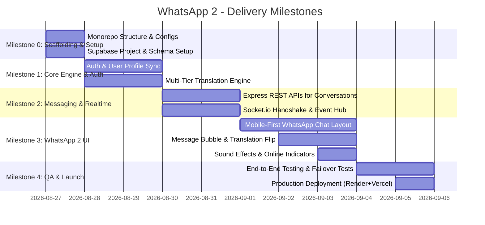

# 📱 WhatsApp 2 - Master Project Plan & Architecture

> **Codename**: *WhatsApp 2 (Chaos Edition / Random Babel)*  
> **Tagline**: *"Parla la tua lingua. Il mondo riceverà il resto."*  
> **Version**: 1.0.0-MVP  
> **Lead Architect**: Lead Engineer  
> **Status**: Approved for Parallel Execution  

---

## 1. Executive Summary & Vision

**WhatsApp 2** è un'applicazione di messaggistica web mobile-first ispirata all'interfaccia elegante e scattante di WhatsApp, arricchita da una meccanica imprevedibile e divertente: **ogni messaggio inviato viene intercettato dal backend e tradotto istantaneamente in una lingua casuale** prima di essere recapitato al destinatario.

Il destinatario vede in primo piano il messaggio tradotto (con badge della lingua e bandierina), ma ha la possibilità di svelare/espandere il messaggio originale inviato con una transizione fluida ("Mostra originale" / "Show Original").

---

## 2. Technical Stack

| Layer | Tecnologia Selezionata | Motivazione / Ruolo |
| :--- | :--- | :--- |
| **Frontend** | React 18+ & Vite & TypeScript | Rendering reattivo fulmineo, Mobile-First responsive UX, typing safety |
| **Styling** | Vanilla Modern CSS (CSS Modules / Variables) | Design System WhatsApp 2 (Dark/Light mode nativo, glassmorphism, zero overhead) |
| **Icons & SFX** | Lucide React + Web Audio API | Icone pulite stile WhatsApp + feedback sonoro 'pop' / 'sent' |
| **Backend** | Node.js (v20+) + Express (ES Modules) | API REST modulari, middleware di autenticazione JWT, controller puliti |
| **Realtime** | Socket.io (v4+) | WebSocket bidirezionale a bassa latenza per messaggi, typing status e presenza online |
| **Database & Auth** | Supabase (PostgreSQL 15 + Supabase Auth) | Gestione utenti, RLS (Row Level Security), storage avatar, persistenza chat |
| **Translation Engine** | Multi-Tier Translation Cascade | Sistema resiliente a 3 livelli: Primary API -> Secondary API -> Offline Mock/Humor Fallback |
| **Deployment** | Render / Railway (Backend) + Vercel / Netlify / Render (Frontend) | Setup CI/CD immediato, variabili d'ambiente protette |

---

## 3. System Architecture & Data Flow

```mermaid
flowchart TD
    subgraph Client ["Frontend (React + Vite)"]
        UI["WhatsApp 2 UI (Chat Screen)"]
        SocketClient["Socket.io Client Manager"]
        SupabaseAuth["Supabase Auth Client"]
    end

    subgraph Server ["Backend (Node.js + Express)"]
        AuthMiddleware["JWT Handshake Middleware"]
        SocketServer["Socket.io Server Hub"]
        ChatController["Chat & Message Service"]
        TransEngine["Translation Pipeline (Cascade)"]
    end

    subgraph TranslationCascade ["Translation Providers"]
        PrimaryAPI["Primary: MyMemory / LibreTranslate API"]
        SecondaryAPI["Secondary: Lingva / Google Free Endpoint"]
        FallbackEngine["Local Fallback: Babel Mock Dictionary / PigLatin / Emoji"]
    end

    subgraph Storage ["Database (Supabase / Postgres)"]
        DB[("PostgreSQL\n(Users, Chats, Messages)")]
        SupabaseStorage[("Supabase Storage\n(Avatars)")]
    end

    %% Auth Flow
    SupabaseAuth -->|1. Sign in / Get JWT| Storage
    SocketClient -->|2. Handshake + JWT Auth| AuthMiddleware
    AuthMiddleware --> SocketServer

    %% Message Flow
    UI -->|3. Send Message (Original Text)| SocketClient
    SocketClient -->|4. Event: chat:send_message| SocketServer
    SocketServer --> ChatController
    ChatController -->|5. Request Random Translation| TransEngine
    
    TransEngine --> PrimaryAPI
    PrimaryAPI -.->|If Timeout/Error| SecondaryAPI
    SecondaryAPI -.->|If Timeout/Error| FallbackEngine
    TransEngine -->|Return Translated + Lang Info| ChatController

    ChatController -->|6. Save Message (Original + Translated)| DB
    ChatController -->|7. Broadcast: chat:new_message| SocketServer
    SocketServer -->|8. Realtime Push to Room| SocketClient
    SocketClient -->|9. Render Translated Bubble + Flip Pill| UI
```

---

## 4. Translation Engine Cascade Strategy

Per garantire che l'app non fallisca **mai**, nemmeno in caso di blocco rate-limit o assenza di API keys esterne, il `TranslationService` implementa il pattern **Chain of Responsibility**:

1. **Tier 1 (Primary)**: API REST pubblica (es. MyMemory API / LibreTranslate free instance). Timeout: 2.5s.
2. **Tier 2 (Secondary)**: Fallback su API secondaria (es. Lingva scraper o Google Translate mini-endpoint). Timeout: 2.5s.
3. **Tier 3 (Offline / Chaos Fallback)**: Generatore interno deterministico con dizionario multi-lingua / "Pirate Speak" / "Yoda Speak" / "Esperanto Glitch" / "Alien Cipher".
   - *Risultato*: 100% uptime garantito. L'utente riceve sempre una traduzione stravagante e divertente.

### Lista Lingue Casuali Supportate (30+):
- 🇯🇵 Giapponese (`ja`), 🇩🇪 Tedesco (`de`), 🇷🇺 Russo (`ru`), 🇸🇦 Arabo (`ar`), 🇫🇷 Francese (`fr`)
- 🇪🇸 Spagnolo (`es`), 🇰🇷 Coreano (`ko`), 🇮🇳 Hindi (`hi`), 🇬🇷 Greco (`el`), 🇸🇪 Svedese (`sv`)
- 🇻🇳 Vietnamita (`vi`), 🇹🇭 Thailandese (`th`), 🇮🇸 Islandese (`is`), 🇿🇦 Swahili (`sw`), 🏴‍☠️ Pirate English (`pirate`)
- 🇮🇹 Latino (`la`), 🌐 Esperanto (`eo`), 🛸 Klingon (`tlh`), 🍕 Napoletano (`nap`), 🧙 Antico Elfico (`elvish`)

---

## 5. Mobile-First WhatsApp 2 Design System

### Palette Colori (Modern WhatsApp 2 Dark / Light Theme)
- **Primary Brand Green**: `#00a884` (WhatsApp modern teal-green)
- **Primary Brand Light**: `#25d366` (Classic accent)
- **Dark Background Core**: `#111b21`
- **Dark Panel / Header**: `#202c33`
- **Dark Bubble (Outgoing - Me)**: `#005c4b`
- **Dark Bubble (Incoming - Translated)**: `#202c33`
- **Chaos Accent / Translation Pill**: `#8b5cf6` (Purple neon accent indicante la traduzione magica)
- **Text Primary**: `#e9edef`
- **Text Secondary / Muted**: `#8696a0`
- **Text Original Hidden**: `#94a3b8`

### UI / UX Core Specs:
1. **Responsive Viewport**: Split-pane su Desktop (Sidebar contatti a sinistra + Chat attiva a destra), vista a schermo intero single-pane su Mobile con transizione fluida e tasto "Indietro" `<`.
2. **Translation Message Bubble**:
   - Testo tradotto gigante e chiaro.
   - Badge lingua sopra o sotto il testo: `[🇯🇵 Tradotto in Giapponese · 78% Chaos]`.
   - Pulsante a forma di pill interattivo: `👁️ Mostra originale` che con un'animazione accordion svela il testo nativo inviato.
3. **Sound Effects (Optional Toggle)**:
   - Suono soft all'invio del messaggio (`send.mp3` o Web Audio oscillator).
   - Suono "pop" di ricezione messaggio tradotto (`receive.mp3`).
4. **Haptic Feedback**: Vibrazione Web API su dispositivi mobile (`navigator.vibrate(20)`) alla ricezione.

---

## 6. Project Directory Structure

```
whatsapp2/
├── client/                      # Frontend (React 18 + Vite + TypeScript)
│   ├── public/                  # Static assets, sounds, favicon
│   │   ├── sounds/              # send.mp3, receive.mp3
│   │   └── favicon.svg
│   ├── src/
│   │   ├── assets/              # Logos, default avatars
│   │   ├── components/          # Reusable UI components
│   │   │   ├── auth/            # LoginForm, RegisterForm, AuthGuard
│   │   │   ├── chat/            # ChatWindow, MessageBubble, MessageInput, Header
│   │   │   ├── sidebar/         # Sidebar, ChatListItem, UserProfileBar, SearchBar
│   │   │   ├── common/          # Avatar, Badge, Button, Modal, Dropdown, Loader
│   │   │   └── translation/     # TranslationBadge, OriginalTextToggle, LangPill
│   │   ├── context/             # React Contexts
│   │   │   ├── AuthContext.tsx  # User session & Supabase state
│   │   │   ├── SocketContext.tsx# Realtime Socket.io connection & events
│   │   │   └── ChatContext.tsx  # Active conversation, messages, typing indicators
│   │   ├── hooks/               # Custom React hooks
│   │   │   ├── useSound.ts      # Audio feedback
│   │   │   ├── useResponsive.ts # Mobile vs Desktop layout detection
│   │   │   └── useTyping.ts     # Debounced typing emitter
│   │   ├── services/            # API & Supabase clients
│   │   │   ├── supabase.ts      # Supabase JS initialization
│   │   │   ├── api.ts           # REST API client (fetch wrapper)
│   │   │   └── socket.ts        # Socket.io client setup
│   │   ├── styles/              # Design system & CSS modules
│   │   │   ├── index.css        # Global CSS variables, reset, typography
│   │   │   ├── animations.css   # Flip, pop, smooth slide-ins
│   │   │   └── themes.css       # WhatsApp Dark/Light mode tokens
│   │   ├── types/               # TypeScript declarations & shared interfaces
│   │   │   ├── chat.ts
│   │   │   ├── user.ts
│   │   │   └── events.ts
│   │   ├── utils/               # Helpers (dates, formatters, language flags)
│   │   │   ├── dateUtils.ts
│   │   │   └── langUtils.ts
│   │   ├── App.tsx              # Root component & screen routing
│   │   └── main.tsx             # Entry point
│   ├── package.json
│   ├── tsconfig.json
│   └── vite.config.ts
│
├── server/                      # Backend (Node.js + Express + Socket.io)
│   ├── src/
│   │   ├── config/              # Environment variables & Supabase Admin
│   │   │   ├── env.js
│   │   │   └── supabase.js
│   │   ├── constants/           # Languages list, error codes, socket events
│   │   │   ├── languages.js
│   │   │   └── socketEvents.js
│   │   ├── controllers/         # Express route controllers
│   │   │   ├── authController.js
│   │   │   ├── chatController.js
│   │   │   ├── userController.js
│   │   │   └── translationController.js
│   │   ├── middlewares/         # Express & Socket.io middlewares
│   │   │   ├── authMiddleware.js      # Bearer JWT verification
│   │   │   ├── socketAuthMiddleware.js# Socket handshake token validation
│   │   │   └── errorHandler.js        # Global error boundary
│   │   ├── routes/              # Express REST routes
│   │   │   ├── authRoutes.js
│   │   │   ├── chatRoutes.js
│   │   │   ├── userRoutes.js
│   │   │   └── index.js
│   │   ├── services/            # Core business logic
│   │   │   ├── messageService.js      # Message creation & persistence
│   │   │   ├── conversationService.js # Rooms & participants
│   │   │   ├── translation/           # Multi-provider translation engine
│   │   │   │   ├── index.js           # Engine entry & orchestrator
│   │   │   │   ├── primaryProvider.js # MyMemory / LibreTranslate
│   │   │   │   ├── secondaryProvider.js# Lingva / Google API
│   │   │   │   ├── fallbackProvider.js # Offline mock dictionary & humor engine
│   │   │   │   └── languagePicker.js  # Random target language selector
│   │   │   └── socketService.js       # Socket.io room handlers & presence
│   │   ├── sockets/             # Socket event handlers
│   │   │   ├── chatHandler.js
│   │   │   ├── presenceHandler.js
│   │   │   └── index.js
│   │   ├── app.js               # Express application configuration
│   │   └── server.js            # HTTP + Socket.io server bootstrap
│   ├── package.json
│   └── .env.example
│
├── shared/                      # Shared Types & Constants (Cross-cutting)
│   └── contract.ts              # Sync definitions between FE and BE
│
├── API_CONTRACT.md              # REST & Socket.io formal specifications
├── DB_SCHEMA.md                 # PostgreSQL DDL, Supabase tables & RLS policies
├── TASKS.md                     # Parallel task assignment for Frontend, Backend, QA
└── PROJECT_PLAN.md              # Master project overview & guidelines
```

---

## 7. Backlog & Milestone Roadmap



### Milestone 0: Scaffolding, Contracts & Tooling (Day 1)
- [x] Initial Architecture & Specifications (`PROJECT_PLAN.md`, `API_CONTRACT.md`, `DB_SCHEMA.md`, `TASKS.md`).
- [ ] Initialize `client/` (Vite + React + TypeScript) and `server/` (Node.js + Express).
- [ ] Setup Supabase PostgreSQL tables, indexes, and test credentials.

### Milestone 1: Authentication & User Sync (Days 2-3)
- [ ] Supabase Auth setup (Email/Password & Quick Anonymous/Username Login).
- [ ] User Profile automatic sync with PostgreSQL `profiles` table.
- [ ] Express JWT validation middleware & Socket.io Handshake auth.

### Milestone 2: Translation Engine & Core Messaging (Days 3-4)
- [ ] Build resilient 3-tier `TranslationService` with random language selector.
- [ ] Build `MessageService` that automatically translates outgoing messages upon saving.
- [ ] Implement conversation participant matching and message pagination.

### Milestone 3: Realtime Socket.io & Mobile-First Frontend (Days 5-7)
- [ ] WhatsApp 2 responsive UI (Sidebar with recent chats + Main chat area).
- [ ] Realtime message delivery via Socket.io (`chat:new_message`).
- [ ] Translation Message Bubble: prominently shows translated text + Language Pill + toggle button to reveal original text with smooth animation.
- [ ] Typing indicator ("*Marco sta scrivendo in Klingon...*") and Online/Offline presence badges.

### Milestone 4: QA, Fallback Resilience & Deployment (Days 8-9)
- [ ] Unit & Integration tests for Translation Fallback (Simulate API outage).
- [ ] Load & concurrency testing on Socket rooms.
- [ ] Deploy backend to Render/Railway and frontend to Render/Vercel.

### Milestone 5: Post-MVP Features (Future Roadmap)
- [ ] **Voice Notes Chaos**: Audio recording with pitch modulation / random robotic accents.
- [ ] **Group Chaos**: In group chats, each recipient receives the message in a *different* random language.
- [ ] **Language Roulette Customizer**: Ability to exclude certain languages or choose a "theme" (Ancient, Sci-Fi, European, Asian).
- [ ] **Meme/Sticker Auto-Translation**: Auto-caption meme translation.

---

## 8. Technical Risks & Mitigations

| Risk / Bottleneck | Severity | Impact | Mitigation Strategy |
| :--- | :---: | :--- | :--- |
| **Translation API Rate-Limiting / Downtime** | 🔴 HIGH | Messages might fail or delay | Multi-tier cascade with 2.5s timeouts + offline fallback dictionary. No message is ever dropped. |
| **High Translation Latency** | 🟡 MED | Slower perceived delivery | Senders get instant optimistic local echo with a subtle "Translating..." shimmer badge before socket broadcast. |
| **Socket Disconnections on Mobile (Sleep/Background)** | 🟡 MED | Missed realtime messages | Socket.io auto-reconnect with exponential backoff + fetch missed message history on room focus. |
| **Supabase Free Tier Inactivity** | 🟢 LOW | Initial cold start | Keepalive ping or simple fallback to standard PostgreSQL connection string. |
